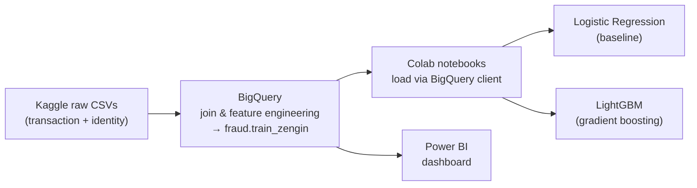

# IEEE-CIS Fraud Detection

Detecting fraudulent card transactions on the [IEEE-CIS Fraud Detection](https://www.kaggle.com/competitions/ieee-fraud-detection/overview) dataset (~590K transactions, 400+ features, **highly imbalanced** at ~3.5% fraud). The project covers the full workflow: **data engineering in Google BigQuery → modeling in Python (Google Colab) → visualization in Power BI.**

<p>
  
  
  
  
  
</p>

## Results

Both models are evaluated on the **same** stratified 80/20 hold-out split (`random_state=42`) for a fair comparison. Because fraud is rare, **ROC-AUC** and **PR-AUC** are reported instead of accuracy (which is misleading on imbalanced data).

| Model                                | ROC-AUC    | PR-AUC     |
| ------------------------------------ | ---------- | ---------- |
| Logistic Regression *(baseline)*     | 0.8847     | 0.4648     |
| **LightGBM** *(gradient boosting)*   | **0.9757** | **0.8834** |

**Takeaway:** LightGBM handles raw `NaN` values and categorical columns natively and captures non-linear / interaction effects, delivering a large jump in **PR-AUC (0.46 → 0.88)** — the metric that matters most for catching rare fraud.

## Pipeline



## Repository structure

```
fraud_detection/
├── IEEE_Fraud_LogisticRegression.ipynb   # Baseline: impute + scale + one-hot, class-weighted LR
├── IEEE_Fraud_LightGBM.ipynb             # Gradient boosting with native NaN/categorical handling
├── IEEE-CIS Fraud Presentation.pbix               # Power BI dashboard
├── requirements.txt                      # Python dependencies (local runs)
├── .env.example                          # Template for the required GCP_PROJECT_ID
├── .gitignore
└── README.md
```

> **Note:** the notebooks include commentary in Turkish. The code, variable names, and metrics are standard and language-agnostic.

## Dataset

The data is **not** included in this repo. Download it from the competition page and load it into your own environment:

- Kaggle: https://www.kaggle.com/competitions/ieee-fraud-detection/data

In this project the raw `transaction` and `identity` tables were joined and feature-engineered in **BigQuery** into a single enriched table (`<project>.fraud.train_zengin`, 590,540 rows × 409 columns), which the notebooks then read through the BigQuery client.

## Configuration — no secrets in code

The Google Cloud **project ID is never hardcoded**. Each notebook reads it from an environment variable named `GCP_PROJECT_ID`, resolved in this order:

1. **Google Colab** → [Colab Secrets](https://twitter.com/GoogleColab/status/1719798406195867814): open the 🔑 icon in the left sidebar, add a secret named `GCP_PROJECT_ID`, and enable notebook access.
2. **Local / other** → a `.env` file loaded by `python-dotenv`.

```python
PROJECT = None
try:
    from google.colab import userdata          # Colab Secrets
    PROJECT = userdata.get("GCP_PROJECT_ID")
except Exception:
    pass
if not PROJECT:
    from dotenv import load_dotenv              # local .env
    load_dotenv()
    PROJECT = os.environ.get("GCP_PROJECT_ID")
```

If the value is missing, the notebook raises a clear error instead of failing later.

## How to run

### Option A — Google Colab (as built)
1. Open either `.ipynb` in Colab.
2. Add a **Secret** named `GCP_PROJECT_ID` (🔑 sidebar) with your GCP project ID.
3. Run all cells. `auth.authenticate_user()` handles Google Cloud authentication.

### Option B — Local Jupyter
```bash
pip install -r requirements.txt
cp .env.example .env          # then edit .env and set GCP_PROJECT_ID
# authenticate to Google Cloud (once):
gcloud auth application-default login
jupyter notebook
```

You need access to a BigQuery project that contains the `fraud.train_zengin` table (built from the Kaggle data).

## Methodology highlights

- **No data leakage** — the train/validation split happens *before* any fitting; imputers, scaler, and one-hot encoder are `fit` on the training set only, then applied to validation.
- **Class imbalance** — both models use `class_weight="balanced"`; evaluation uses ROC-AUC and PR-AUC rather than accuracy.
- **Memory optimization** — `float64 → float32` and `int64 → int32` downcasting keeps the ~590K × 409 dataframe within Colab RAM.
- **Logistic Regression (baseline)** — `SimpleImputer` + `StandardScaler` for numeric features; `OneHotEncoder(handle_unknown="ignore", min_frequency=0.001)` collapses rare categories; a solid linear reference point for the tree models.
- **LightGBM** — no imputation, scaling, or one-hot needed: `NaN`s and `category` dtypes are handled natively. Uses **early stopping** (100 rounds) on the validation AUC to prevent overfitting; best iteration ≈ 1983 / 2000.
- **Feature importance** — the LightGBM notebook plots the top-20 features by gain.

## Power BI dashboard

`IEEE-CIS Fraud Presentation.pbix` contains an interactive dashboard built on the same data. Open it with [Power BI Desktop](https://www.microsoft.com/power-platform/products/power-bi/desktop).

## Tech stack

**BigQuery** (SQL feature engineering) · **Python** · **pandas / NumPy** · **scikit-learn** · **LightGBM** · **Matplotlib** · **Google Colab** · **Power BI**

## Team

- **Omer Meraloglu** — [LinkedIn](https://www.linkedin.com/in/omer-meraloglu/)
- **Dogukan Gunduz** — [LinkedIn](https://www.linkedin.com/in/do%C4%9Fukan-g%C3%BCnd%C3%BCz-383315303/)
- **Asli Candan** — [LinkedIn](https://www.linkedin.com/in/asl%C4%B1-c-aaa500376/)
