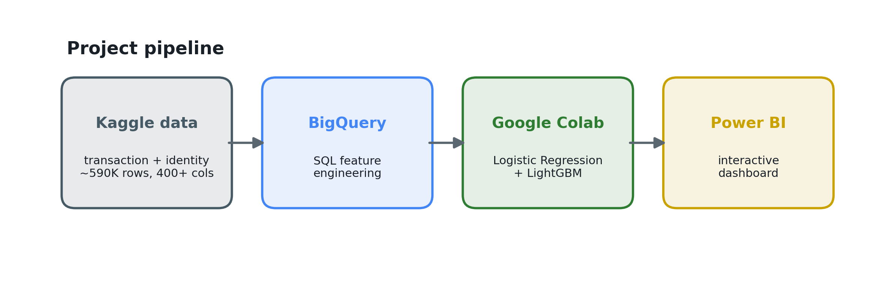
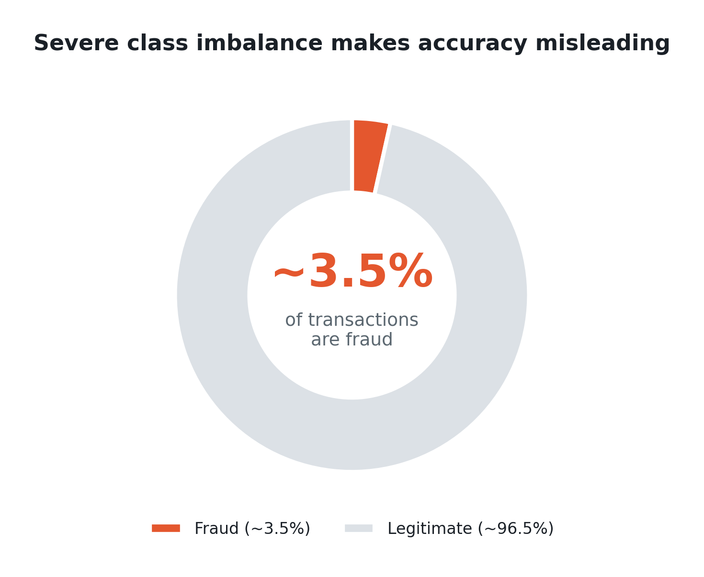
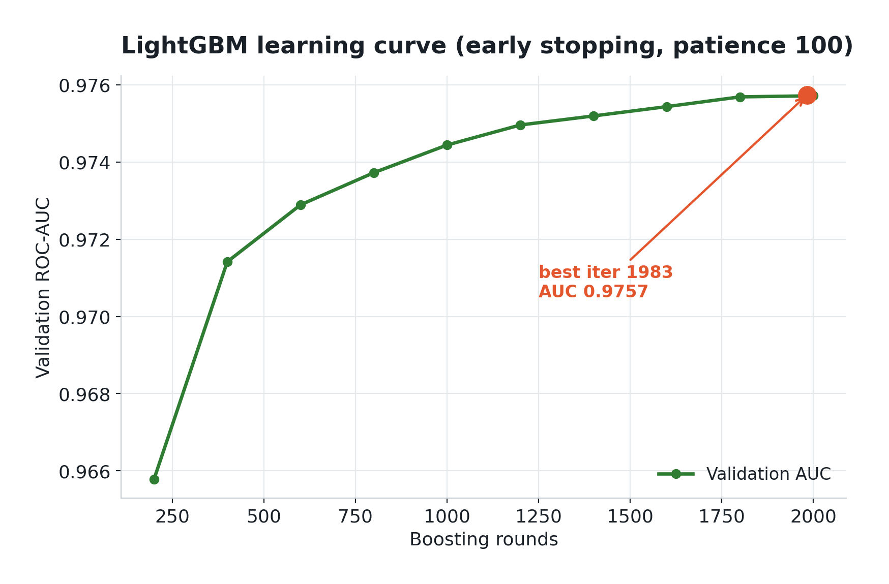
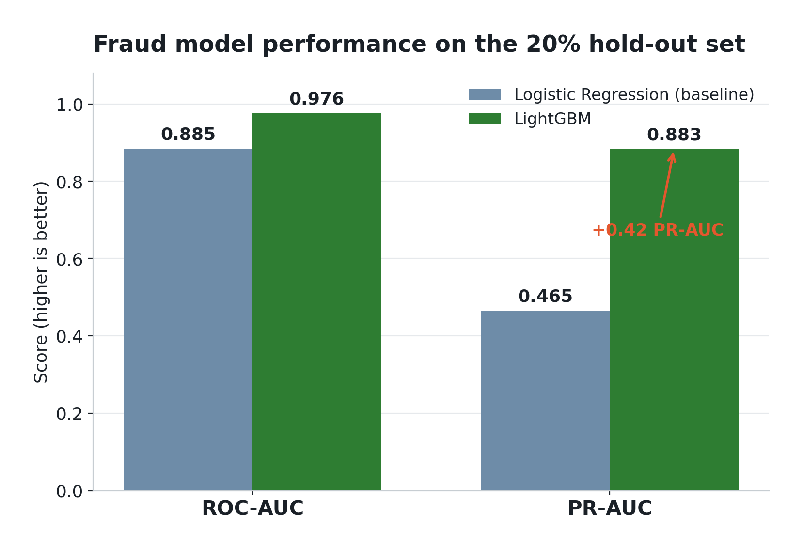

# Catching Card Fraud When Only 3.5% of Transactions Are Fraudulent

*An end-to-end walkthrough on the IEEE-CIS Fraud Detection dataset — BigQuery feature engineering, a Logistic Regression baseline, and a LightGBM model that lifted PR-AUC from 0.46 to 0.88.*

---

Card fraud is a classic needle-in-a-haystack problem. In the [IEEE-CIS Fraud Detection](https://www.kaggle.com/competitions/ieee-fraud-detection/overview) dataset, only about **3.5% of transactions are fraudulent**. That single fact shapes every decision that follows — from which metric you trust, to which model you reach for.

This post walks through how we took the raw Kaggle data all the way to a working model and dashboard, and what the numbers taught us about the intersection of data and finance.

## The pipeline

We kept the workflow deliberately simple and reproducible: engineer features in BigQuery, model in Python on Google Colab, and present the results in Power BI.



The raw competition data comes in two tables — `transaction` and `identity`. We joined and cleaned them in **BigQuery** into a single enriched table of **590,540 rows and 409 columns**, then pulled that straight into Colab through the BigQuery Python client.

```python
df = client.query(
    f"SELECT * FROM `{PROJECT}.fraud.train_zengin`"
).to_dataframe()

# Downcast to fit ~590K x 409 in Colab RAM
for c in df.columns:
    if df[c].dtype == 'float64':
        df[c] = df[c].astype('float32')
    elif df[c].dtype == 'int64':
        df[c] = df[c].astype('int32')
```

That downcasting step is not cosmetic. On a dataframe this wide, keeping everything in `float64` is the difference between fitting in memory and crashing the runtime.

## Why accuracy is a trap

The first instinct on any classification problem is to check accuracy. On imbalanced fraud data, that instinct is wrong.



A model that predicts "not fraud" for **every** transaction is already ~96.5% accurate — and completely useless, because it never catches a single fraudulent charge. So we ignored accuracy entirely and evaluated on two metrics that actually respect the imbalance:

- **ROC-AUC** — how well the model ranks fraud above non-fraud across all thresholds.
- **PR-AUC** (average precision) — precision vs. recall specifically on the rare positive class. On imbalanced problems, this is the number that matters most.

## Guarding against data leakage

The most common way to fool yourself on a project like this is data leakage — letting information from the validation set sneak into training. The fix is discipline about *ordering*: **split first, then fit every transformer on the training set only.**

```python
# Split BEFORE any imputing / scaling / encoding
X_train, X_val, y_train, y_val = train_test_split(
    X, y, test_size=0.2, stratify=y, random_state=42)

# Fit on train, apply to validation
scaler = StandardScaler()
train_num = scaler.fit_transform(imputer.fit_transform(X_train[numeric_features]))
val_num   = scaler.transform(imputer.transform(X_val[numeric_features]))
```

Using `stratify=y` keeps the same ~3.5% fraud rate in both splits, and fixing `random_state=42` means both models see the *exact* same split — so the comparison at the end is fair.

## The baseline: Logistic Regression

Every project deserves a simple, honest baseline before you reach for something fancy. For Logistic Regression that meant a full preprocessing pipeline: impute missing values, scale the numeric columns, and one-hot encode the categoricals (`card4`, `card6`, `P_emaildomain`, `DeviceType`, and so on). Rare categories were collapsed with `min_frequency` to keep the feature space sane, and `class_weight="balanced"` handled the imbalance.

The result: **ROC-AUC 0.885, PR-AUC 0.465.** A respectable, linear reference point — and a reminder that a linear model can rank reasonably well (0.885 ROC-AUC) while still being weak at the thing we actually care about (0.465 PR-AUC).

## LightGBM: let the trees do the work

Gradient-boosted trees are a natural fit for tabular fraud data, and LightGBM removes most of the preprocessing burden. It handles missing values and categorical columns **natively** — no imputation, no scaling, no one-hot. You just mark the categoricals and hand it the frame.

```python
categorical_features = X.select_dtypes(include=['object']).columns.tolist()
for c in categorical_features:
    X[c] = X[c].astype('category')   # LightGBM uses these natively

lgbm = lgb.LGBMClassifier(
    n_estimators=2000, learning_rate=0.03, num_leaves=128,
    subsample=0.8, colsample_bytree=0.8,
    class_weight='balanced', random_state=42, n_jobs=-1)

lgbm.fit(X_train, y_train, eval_set=[(X_val, y_val)], eval_metric='auc',
         callbacks=[lgb.early_stopping(100)])
```

Early stopping (patience 100) watches the validation AUC and halts once it stops improving, which guards against overfitting and saves compute. The learning curve tells the story — a fast climb, then a long, gentle plateau that peaked at iteration 1983.



## Results

Same data, same split, two very different outcomes.



| Model                            | ROC-AUC    | PR-AUC     |
| -------------------------------- | ---------- | ---------- |
| Logistic Regression (baseline)   | 0.885      | 0.465      |
| **LightGBM**                     | **0.976**  | **0.883**  |

The ROC-AUC gap looks modest (0.885 → 0.976), but the **PR-AUC nearly doubled, from 0.465 to 0.883.** That is the headline. On a problem where the positive class is only 3.5% of the data, PR-AUC is the metric that reflects real-world value — catching fraud without drowning analysts in false alarms — and it is exactly where the tree model pulled away. LightGBM's ability to model non-linear interactions between hundreds of features is what a linear model simply cannot reach.

## A small engineering note: no secrets in the code

Because this project became a public repo, the Google Cloud project ID never got hardcoded. Each notebook reads it from an environment variable — Colab Secrets when running in Colab, or a local `.env` file otherwise — and raises a clear error if it is missing. It is a small habit, but it is the difference between a portfolio repo you can share freely and one you have to scrub in a panic later.

## What I took away

Beyond the modeling, this project was a genuinely useful lens on where **data meets finance**. Fraud is not a balanced, well-behaved classification toy — it is rare, costly, and asymmetric, and those properties change how you measure success. The biggest lesson was not "use LightGBM." It was that **choosing the right metric for the business problem matters more than squeezing the last decimal out of a model.** A 96.5%-accurate model that catches no fraud is worthless; a model optimized for PR-AUC is the one a risk team can actually use.

---

**Project & code**

- GitHub repo: *(add your link)*
- Dataset: [IEEE-CIS Fraud Detection on Kaggle](https://www.kaggle.com/competitions/ieee-fraud-detection/overview)

**Team**

- Omer Meraloglu — [LinkedIn](https://www.linkedin.com/in/omer-meraloglu/)
- Dogukan Gunduz — [LinkedIn](https://www.linkedin.com/in/do%C4%9Fukan-g%C3%BCnd%C3%BCz-383315303/)
- Asli Candan — [LinkedIn](https://www.linkedin.com/in/asl%C4%B1-c-aaa500376/)

*Tech stack: BigQuery · Python · pandas / NumPy · scikit-learn · LightGBM · Google Colab · Power BI*
